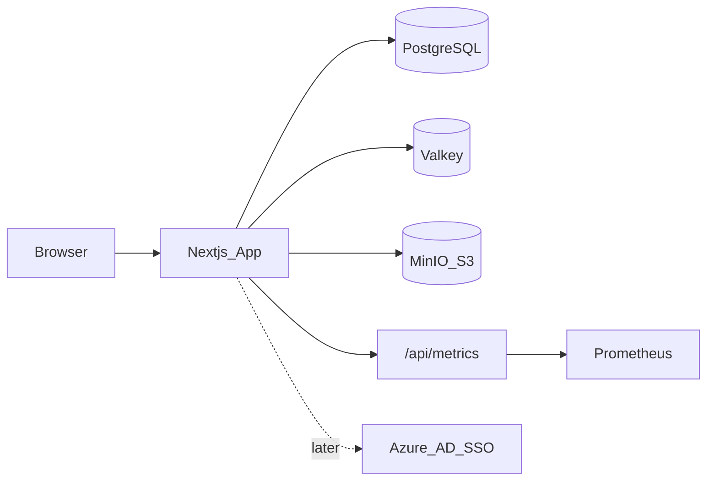

# ForgeDocs Interview-Prep Build Plan

Scaffold and build ForgeDocs as a multi-tenant Next.js document workspace covering the full interview stack: TipTap editing, Word/PDF export, Prisma/Postgres RBAC isolation, MinIO (S3), Valkey, Prometheus, Docker, Vitest/Playwright, and GitLab CI — with Azure AD SSO added after the core app works.

## Locked decisions

- **App:** ForgeDocs — multi-tenant team documents
- **Shape:** Single Next.js (App Router) + TypeScript app (no monorepo)
- **Object storage:** MinIO in Docker (S3-compatible API); same client code works with AWS S3 later
- **Auth sequence:** Dev credentials / test bypass first; Azure AD (Auth.js Microsoft Entra) after CRUD + TipTap + export work
- **Local infra:** Docker Compose for Postgres, Valkey, MinIO, Prometheus

## Product scope

Users belong to a **tenant** via **membership + role** (`owner` | `admin` | `editor` | `viewer`). They create/edit TipTap documents scoped to that tenant, upload images to MinIO, and export Word/PDF. Hard rule: every document query is tenant-scoped via a Prisma client extension (fail closed).



## Target layout

```
ForgeDocs/
  prisma/schema.prisma
  docker-compose.yml
  Dockerfile
  .gitlab-ci.yml
  prometheus.yml
  src/
    app/                  # App Router pages + API routes
    components/editor/    # TipTap
    server/
      db.ts               # Prisma + tenant extension
      auth.ts             # session helpers
      rbac.ts
      export/             # TipTap JSON → DOCX/PDF
      storage.ts          # S3/MinIO client
      cache.ts            # Valkey
      metrics.ts
  tests/
    unit/                 # Vitest
    e2e/                  # Playwright
```

## Data model (Prisma)

- `Tenant` — id, slug, name
- `User` — id, email, name, `azureOid` (nullable until SSO)
- `Membership` — userId, tenantId, role (unique on user+tenant)
- `Document` — tenantId, title, `content` (Json TipTap), createdById, timestamps
- `ExportJob` — documentId, format (`docx`|`pdf`), status, s3Key, error

Seed two tenants (Acme / Globex) with users in different roles so isolation and RBAC are demoable in minutes.

## Implementation phases

### Phase 0 — Skeleton

- `create-next-app` with TypeScript, App Router, ESLint
- Docker Compose: `postgres`, `valkey`, `minio`, `prometheus`
- Prisma schema + migrate; `.env.example`
- Vitest + Playwright wiring; GitLab CI: `lint` → `typecheck` → `test` → `build`
- Dev auth: email/password or magic “login as seeded user” for local + CI

### Phase 1 — Multi-tenant CRUD + RBAC

- Middleware/session resolves user + active `tenantId` + role
- Document list/create/read/update/delete API + UI
- Prisma extension injects/requires `tenantId` on Document queries
- Vitest: role matrix; Playwright: viewer cannot PATCH document

### Phase 2 — TipTap

- TipTap editor (starter kit + tables + image)
- Persist JSON; debounced autosave
- Image upload API → MinIO key prefixed by `tenantId`

### Phase 3 — Export pipeline

- `POST /api/documents/:id/export` creates `ExportJob`, stores status in DB (+ Valkey for quick poll)
- Transform TipTap JSON → DOCX (`docx` library)
- PDF via HTML render of document → PDF (Puppeteer/Chromium in Docker)
- Upload artifacts to MinIO; return signed URL
- Vitest on JSON→DOCX mapping; Playwright export happy path

### Phase 4 — Azure AD SSO

- Auth.js Microsoft Entra ID provider
- Map `oid`/email → User; membership still required for access
- Keep `AUTH_E2E_BYPASS` (or credentials) only when `NODE_ENV=test` / explicit env for Playwright

### Phase 5 — Observability + polish

- Prometheus metrics: HTTP duration, export success/fail counters
- Multi-stage Dockerfile; README with architecture + demo script
- Confluence-style `docs/architecture.md` (tooling stand-in)

### Phase 6 — Production path (cloud deploy) ✅

**Done on Railway:** app + managed Postgres + Redis + AWS S3 + Azure AD SSO; Prometheus scrapes public/private `/api/metrics`; GitHub `main` auto-deploys `web` and `prometheus`.

**Local baseline unchanged:** Docker Compose provides Postgres, Valkey, MinIO, and Prometheus; `npm run dev` against those services.

- **Hosting:** Railway (`Dockerfile` for `web`, `ops/prometheus` for scraper); GitHub repo connected → deploy on push to `main`
- **Database / cache:** Railway Postgres + Redis (`DATABASE_URL`, `VALKEY_URL`)
- **Object storage:** AWS S3 (`forgedocs-673396345120`); no MinIO in prod; `S3_ENDPOINT` unset, path-style off
- **Auth:** Azure AD only in production (`ALLOW_CREDENTIALS_LOGIN=false`); credentials remain for local/CI
- **Smoke check:** SSO login, tenant isolation, TipTap save, Word/PDF → S3, Prometheus scrape UP

Local Docker Compose remains the default for day-to-day development.

### Phase 7 — Product depth (was “out of scope”)

Features that move ForgeDocs beyond the interview MVP toward a more believable docs product:

- **Realtime collaboration** ✅ — presence + remote cursors via Valkey pub/sub and SSE (last-write-wins autosave; Yjs/CRDT still future)
- **Per-document ACL** ✅ — elevate-only grants: tenant viewers can be granted `editor` on a single doc (creator / admin / owner manage via Share UI)
- **Invite emails** ✅ — admin/owner invites on `/team`; demo delivery returns/logs the accept link (Resend/SMTP later); accept provisions membership then login
- **Full Grafana dashboards** ✅ — Railway Grafana provisioned against Prometheus; ForgeDocs overview (HTTP rate/latency/status, export jobs, 5xx by route)
- **Production AWS deploy hardening** — beyond Phase 6 smoke deploy: IAM roles (prefer over long-lived keys), HTTPS, backups, basic runbooks

### Phase 8 — UX, value, and product evaluation

Polish and product thinking so the demo feels intentional, not only stacked:

- **Improve styles** — cohesive visual system (typography, spacing, dark/light if needed), editor chrome, empty states
- **Improve UX** — clearer navigation, save/export feedback, role-aware UI, onboarding for first SSO login
- **Add real-value features** — e.g. search, doc templates, version history, comments, trash/restore (pick a few that matter in interviews)
- **Discuss further improvements** — backlog of intentional follow-ups (tech debt, security, scale)
- **Evaluate against similar products** — compare ForgeDocs to Notion / Confluence / Google Docs / SharePoint-style tools; document gaps, differentiators, and what you’d build next and why

## Interview demo script

1. Login as Acme editor → create/edit TipTap doc
2. Export Word + PDF
3. Login as Globex user → Acme docs absent
4. Login as viewer → edit denied
5. Show `/api/metrics` and green GitLab pipeline
6. (Phase 6) Show deployed URL with Azure AD login + real S3 exports
7. (Phase 7+) Call out deeper features — e.g. elevate ACL, Team invites, Grafana, or two sessions showing presence avatars/cursors on one doc

